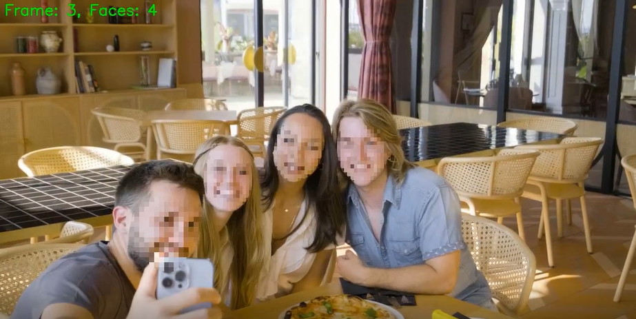

# Face Anonymization in Video

Faces anonymization in video feed using either pixelation or blurring techniques.




## Features

- Person detection using YOLOv5
- Face landmark detection using MediaPipe
- Two anonymization methods: pixelation and blurring


## Requirements

````
pip install -r requirements.txt
````

## Usage

Options:
- `--method`: Choose between 'pixelation' (default) and 'blurring'

````
py app.py ---method pixelation
py app.py ---method blurring
````